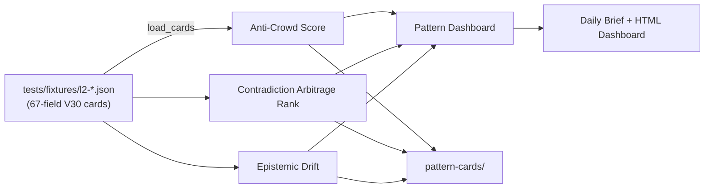

# RIG Pattern Engines — Three Novel-to-the-World Strategic Analysis Engines

Deterministic pattern-recognition engines for V30 build-cards. No LLM calls, no API keys, no black boxes — just structured signal extracted from a corpus of 141-field-aware cards.

| Engine | Core question | What it finds |
|--------|---------------|---------------|
| **Anti-Crowd Score (ACS)** | *Where is everyone wrong together?* | Under-owned strategy zones with large TAM, low competitor density, and high RIG unfair advantage. |
| **Contradiction Arbitrage Rank (CAR)** | *What are two experts saying that cancels out?* | Pairs of cards that contradict each other, ranked by centrality, evidence tension, and breakthrough probability. |
| **Epistemic Drift** | *What word no longer means what it meant?* | Concepts that are migrating across domains, vocabulary frontiers, and 6-month leading-indicator strategies. |

## Score counts

| Engine | Baseline | Upgraded |
|--------|----------|----------|
| Anti-Crowd Score | 7 core scores | **35 signal fields per strategy** (market sizing, regulatory taxonomy, HHI concentration, RIG coverage, revenue, time-to-build, etc.) |
| Contradiction Arbitrage Rank | 145 directed contradiction entries | **145+ scored contradiction entries**, each enriched with PageRank centrality, evidence velocity, resolution state, numeric confidence interval, and weeks-to-resolution |
| Epistemic Drift | 27 strategy score fields | **27 strategy score fields + per-month concept-velocity time-series** |

## Architecture



## Install

```bash
pip install rig-pattern-engines
```

Or clone and install in editable mode:

```bash
git clone https://github.com/rig-intelligence/rig-pattern-engines.git
cd rig-pattern-engines
pip install -e .
```

## Usage

All engines run deterministically from a directory of `l2-*.json` build cards.

### Anti-Crowd Score

```bash
# CLI entry point installed by pip
rig-anticrowd all --cards-dir ./cards

# Or as a module
python -m rig_pattern_engines.pattern_anticrowd all --cards-dir ./cards
rig-anticrowd brief
```

### Contradiction Arbitrage Rank

```bash
rig-contradiction all --cards-dir ./cards --top-n 5
rig-contradiction brief --cards-dir ./cards
rig-contradiction status --cards-dir ./cards
```

### Epistemic Drift

```bash
rig-drift all --cards-dir ./cards --top-n 5
rig-drift brief --cards-dir ./cards
rig-drift status --cards-dir ./cards
```

### Python API

```python
from pathlib import Path
from rig_pattern_engines import (
    anticrowd_score,
    contradiction_compute,
    drift_compute,
)

cards_dir = Path("./cards")

acs = anticrowd_score(cards_dir=cards_dir)
print(acs["top_strategy"], acs["top_risk_adjusted"])

cards = [json.loads(p.read_text()) for p in sorted(cards_dir.glob("l2-*.json"))]
car = contradiction_compute(cards)
print(car["metadata"]["count"], "contradiction pairs")

drift = drift_compute(cards_dir=cards_dir)
print(drift["leading_indicator_count"], "leading-indicator strategies")
```

## Sample output

### Anti-Crowd Score (per strategy)

```json
{
  "strategy_id": "pricing-finance",
  "tier": "T1",
  "card_count": 12,
  "acs": 71.42,
  "market_size": {"min": 1.2e9, "max": 4.8e9, "median": 2.9e9},
  "market_size_score": 0.3125,
  "regulatory_barrier": 0.15,
  "regulatory_taxonomy": {"privacy": 2, "finance": 5, "general_compliance": 1},
  "competitor_density": 0.33,
  "competitor_hhi": 0.0625,
  "effective_competitors": 16.0,
  "rig_advantage": 0.82,
  "rig_coverage_ratio": 0.41,
  "revenue_potential": 1440000.0,
  "time_to_build": {"estimated_days": 14.0, "time_to_build_score": 0.7906},
  "risk_adjusted_opportunity_score": 18.73,
  "recommendation": "ENTER"
}
```

### Contradiction Arbitrage Rank (per pair)

```json
{
  "pair": ["l2-aaa...", "l2-bbb..."],
  "car": 0.9124,
  "state": "tilting_a",
  "components": {
    "D": 0.85,
    "E": 0.42,
    "C_link": 0.71,
    "C_page": 0.63,
    "V": 0.55,
    "R": 0.88,
    "T": 0.92,
    "X": 1.4
  },
  "breakthrough": {
    "probability": 0.78,
    "predicted_direction": "l2-aaa...",
    "direction_label": "l2-aaa... gaining",
    "confidence": "high",
    "confidence_interval": {"lower": 0.62, "upper": 0.91},
    "time_to_resolution_weeks": 4
  }
}
```

### Epistemic Drift (per strategy)

```json
{
  "strategy_id": "agent-identity",
  "card_count": 9,
  "frontier_ratio": 0.41,
  "emerging_ratio": 0.23,
  "established_ratio": 0.36,
  "cross_domain_ratio": 0.31,
  "bridge_ratio": 0.19,
  "drift_velocity": 0.22,
  "composite_drift_score": 0.48,
  "leading_indicator": true,
  "prediction": "6-month leading indicator — high frontier + bridge density"
}
```

## Card schema overview

Each `l2-*.json` card is a 67-field JSON document. The engines consume these field groups:

| Group | Key fields |
|-------|------------|
| Identity | `card_id`, `schema`, `created_at`, `enriched_at`, `card_sha256` |
| Claim & mechanism | `claim`, `mechanism`, `idea`, `direction`, `outcome` |
| Evidence | `evidence`, `sources`, `consensus`, `semantic_links` |
| Entities | `entities` (typed: TOOL, COMPANY, FRAMEWORK, CONCEPT, METHOD, …) |
| Business | `business_intelligence.tam`, `estimated_ltv`, `revenue_model`, `build_effort` |
| Engineering | `engineering_blueprint.estimated_loc`, `gtm_strategy`, `oss_integration` |
| Scoring & governance | `score`, `council`, `council_verdict`, `doctrine_domains`, `promotion_state` |
| Temporal & semantic | `temporal_validity`, `tags`, `topic`, `strategy`, `pattern` |

The engines do not require all 67 fields to be populated; missing values fall back to sensible defaults.

## Tests

```bash
pip install -e ".[test]"
pytest tests/
```

The smoke tests in `tests/test_engines.py` verify that each engine loads cards, produces scores, and generates briefs.

## License

MIT — see [LICENSE](LICENSE).

## Contributing

See [CONTRIBUTING.md](CONTRIBUTING.md) for the workflow, coding standards, and how to add a new pattern dimension.
